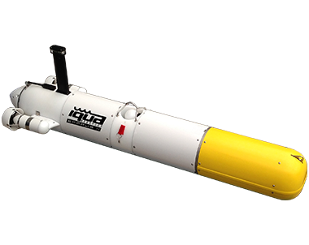

[![Contributors][contributors-shield]][contributors-url]
[![Forks][forks-shield]][forks-url]
[![Stargazers][stars-shield]][stars-url]
[![Issues][issues-shield]][issues-url]
[![MIT License][license-shield]][license-url]
[![LinkedIn][linkedin-shield]][linkedin-url]

<!-- PROJECT LOGO -->
 

  <h1 align="center">Modelling and Control of Underwater Vehicle (Sparus)</h1>

  

    A project for the modelling and control of the IQUA Robotics autonomous underwater vehicle called Sparus. This project is submitted as part of the evaluation of the Underwater Robotics course in the Marine and Maritime Intelligent Robotics Master, Université de Toulon.
     
    
    .
    
     
    <a href="https://github.com/olanrewajufarooq/MIRUnderwaterRobotics">View Project Files »</a>
     
  

## Description

The Sparus autonomous underwater vehicle, developed by IQUA Robotics, is specialized for shallow waters up to 200 meters deep. It features a rear configuration with two horizontal thrusters and a central vertical thruster, enabling precise maneuverability. The vehicle is equipped with an antenna for wireless communication, a Doppler Velocity Log (DVL) and an Ultra-Short Baseline (USBL) system for accurate navigation, an Inertial Measurement Unit (IMU) for orientation, and depth sensors for depth measurement. The vehicle's modeling approach is tailored to optimize control by effectively utilizing its parameters, ensuring reliable and precise performance in its designated tasks underwater.

  
   Image of IQUA Robotics Sparus

### Tasks Completed in the project include:

1. Computation of the rigid-body general mass matrix (including the mass matrix and the inertia tensors) and the added-mass matrix. 
2. Drag Parameters Identification
3. Coriolis Components Modelling
4. Thruster Modelling
5. Validating using a Simulink-based Simulator

The original simulator is in the `SparusSim` folder (although there are a couple of problems in the original simulator which have been corrected in the `SimSolution` folder) while the solutions from the modelling and testing are implemented in the `SimSolution` folder. Tasks 1-3 are initially developped in the `SparusIICalculations.mlx` file. While tasks 1-4 are implemented in the files: `SimSolution/parameters.m` and `SimSolution/RovModel.m`. The validation is evaluated by running the simulator in `SimSolution/Sparus_3D_advance_model.mdl` while the data obtained are plotted using the codes in `SimSolution/plotting.m`.

## Software Used

- MATLAB
- Simulink

## Usage

1. Open the Simulink file in `SimSolution/Sparus_3D_advance_model.mdl`
2. Implement the command using `SimSolution/command.m` or the matrix input in the Simulink simulation. (Take note of the switch between both modes)
3. The plotting function is added as a stopFcn() to the Simulink simulation.

<!-- CONTACT -->
## Contact Contributors

* Farooq Olanrewaju - olanrewajufarooq@yahoo.com, farooq-olanrewaju@etud.univ-tln.fr
* Nimra Jabeen - nimrajabeen246@gmail.com

For more information on the project analysis, check: `Underwater_Robotics_Report.pdf`

<strong>Supervisor</strong>: Dr. Mathieu Richier, <i>Maitre Conference, Université de Toulon</i>.

(<a href="#readme-top">back to top</a>)

<!-- MARKDOWN LINKS & IMAGES -->
<!-- https://www.markdownguide.org/basic-syntax/#reference-style-links -->
[contributors-shield]: https://img.shields.io/github/contributors/olanrewajufarooq/MIRUnderwaterRobotics.svg?style=for-the-badge
[contributors-url]: https://github.com/olanrewajufarooq/MIRUnderwaterRobotics/graphs/contributors
[forks-shield]: https://img.shields.io/github/forks/olanrewajufarooq/MIRUnderwaterRobotics.svg?style=for-the-badge
[forks-url]: https://github.com/olanrewajufarooq/MIRUnderwaterRobotics/network/members
[stars-shield]: https://img.shields.io/github/stars/olanrewajufarooq/MIRUnderwaterRobotics.svg?style=for-the-badge
[stars-url]: https://github.com/olanrewajufarooq/MIRUnderwaterRobotics/stargazers
[issues-shield]: https://img.shields.io/github/issues/olanrewajufarooq/MIRUnderwaterRobotics.svg?style=for-the-badge
[issues-url]: https://github.com/olanrewajufarooq/MIRUnderwaterRobotics/issues
[license-shield]: https://img.shields.io/github/license/olanrewajufarooq/MIRUnderwaterRobotics.svg?style=for-the-badge
[license-url]: https://github.com/olanrewajufarooq/MIRUnderwaterRobotics/blob/main/LICENSE
[linkedin-shield]: https://img.shields.io/badge/-LinkedIn-black.svg?style=for-the-badge&logo=linkedin&colorB=555
[linkedin-url]: https://linkedin.com/in/olanrewajufarooq
